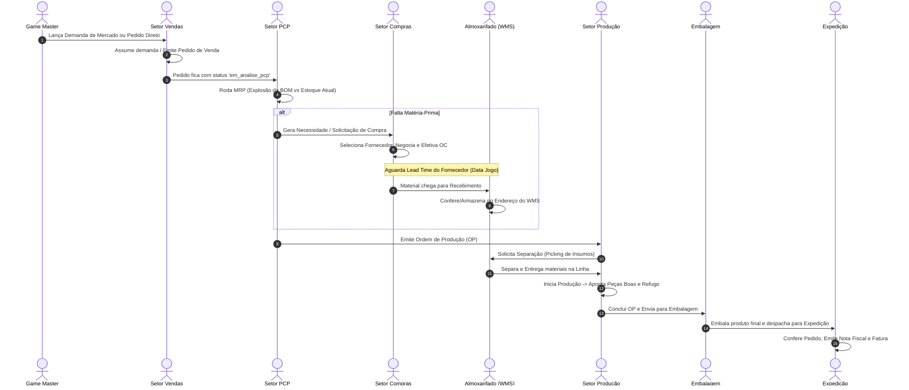

# 🔄 REGRAS DE NEGÓCIO E FLUXOS OPERACIONAIS

Este documento detalha o funcionamento ponta a ponta da cadeia de suprimentos e produção gamificada.

---

## 1. O Pipeline da Fábrica Digital

---

## 2. Detalhamento de Cada Estágio

### A. Setor Comercial / Vendas
- **Entrada**: Demandas geradas pelo professor ou criação manual de pedidos.
- **Regras**:
  - Respeita o `limite_vendas_diarias` configurado na turma pelo professor.
  - Verifica se o cliente pertence à mesma turma.
  - Ao salvar o pedido, calcula o valor total somando os itens (`preco_venda * quantidade`).

### B. PCP (Planejamento e Controle da Produção)
- **Entrada**: Pedidos de Venda aguardando liberação.
- **Regras (Cálculo MRP)**:
  - Para cada item do pedido, consulta a tabela `estrutura_produto` (BOM).
  - Calcula: `Insumo Necessário = Qtd Pedida * Qtd BOM`.
  - Compara com `Estoque Disponível` (Estoque Físico - Reservas).
  - Se faltar insumo: gera `ordens_compra` pendentes no setor de compras.
  - Se houver estoque ou assim que provisionado: gera `ordens_producao` (OP).

### C. Setor de Compras
- **Entrada**: Necessidades de compra geradas pelo PCP ou recompra manual.
- **Regras**:
  - Seleção de fornecedor com base em menor preço, prazo de entrega (*Lead Time*) ou confiabilidade.
  - `data_entrega_prevista = data_jogo_atual + lead_time_dias`.
  - Impacto financeiro no `saldo_caixa` da empresa.

### D. Almoxarifado / WMS
- **Entrada 1 (Recebimento)**: Ordens de compra que chegaram no dia virtual (`data_jogo >= data_entrega_prevista`).
  - Aluno confere quantidade e conformidade. Pode aprovar ou recusar (*avaria / divergência*).
- **Entrada 2 (Endereçamento)**: Armazenamento nos endereços físicos do armazém (Rua / Prédio / Nível / Vão).
- **Entrada 3 (Separação / Picking)**: Atendimento às requisições de matéria-prima vindas da Produção.

### E. Setor de Produção
- **Entrada**: Ordens de Produção (OP) liberadas.
- **Regras**:
  - O operador assume a OP (`aluno_id`), solicita os insumos ao Almoxarifado e dá `Start` na produção.
  - Consome o tempo do turno conforme a `capacidade_producao` da turma.
  - Realiza apontamentos periódicos de quantidade produzida e quantidade refugada.
  - Trata eventos de máquina parada e refugo forçado (injetados pelo Game Master).

### F. Setor de Embalagem
- **Entrada**: Lotes de produtos acabados vindos da linha.
- **Regras**:
  - Validação da integridade e etiquetagem dos lotes.
  - Liberação com 1 clique para a doca de expedição.

### G. Setor de Expedição e Faturamento
- **Entrada**: Pedidos prontos na doca.
- **Regras**:
  - Conferência final (Picking List vs Pedido de Venda).
  - Emissão da Nota Fiscal Eletrônica simulada (`notas_fiscais`).
  - Conclusão do ciclo comercial com entrada do faturamento no caixa da turma.
